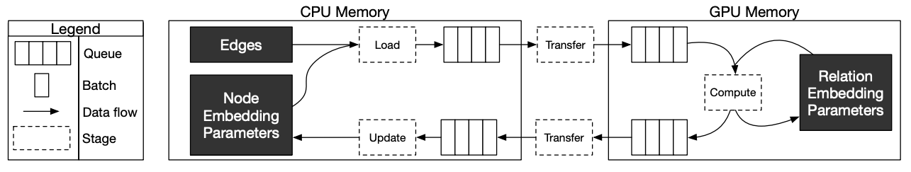

Overview
======================

The configuration interface allows for high-performance training and evaluation of models without need for writing code.

Configuration files are defined in YAML format and are grouped up into four sections:

- Model: Defines the architecture of the model, neighbor sampling configuration, loss, and optimizer(s)
- Storage: Specifies the input dataset and how to store the graph, features, and embeddings.
- Training: Sets options for the training procedure and hyperparameters. E.g. batch size, negative sampling.
- Evaluation: Sets options for the evaluation procedure (if any). The options here are similar to those in the training section.

Link Prediction Example
-----------------------

In this example, we show how to define a configuration file for training a :doc:`3-layer GraphSage GNN <../examples/config/lp_fb15k237>` for link prediction on :doc:`fb15k_237 <../examples/config/lp_fb15k237>`.

This example assumes that marius has been installed with :doc:`pip <../build>` the dataset has been preprocessed with the following command:

``marius_preprocess --dataset fb15k_237 --output_dir /home/data/datasets/fb15k_237/``

1. Define the model:
^^^^^^^^^^^^^^^^^^^^

+-------------------------------------------+-----------------------------------------------+
|                                           |                                               |
|.. code-block:: yaml                       |.. image:: ../assets/configuration_lp.png      |
|                                           |  :width: 700                                  |
|   model:                                  |                                               |
|     encoder:                              |                                               |
|       train_neighbor_sampling:            |                                               |
|         - type: ALL                       |                                               |
|         - type: ALL                       |                                               |
|         - type: ALL                       |                                               |
|       layers:                             |                                               |
|         - - type: EMBEDDING               |                                               |
|             output_dim: 50                |                                               |
|             bias: true                    |                                               |
|                                           |                                               |
|           - type: FEATURE                 |                                               |
|             output_dim: 50                |                                               |
|             bias: true                    |                                               |
|                                           |                                               |
|         - - type: REDUCTION               |                                               |
|             input_dim: 100                |                                               |
|             output_dim: 50                |                                               |
|             bias: true                    |                                               |
|             options:                      |                                               |
|               type: LINEAR                |                                               |
|                                           |                                               |
|         - - type: GNN                     |                                               |
|             options:                      |                                               |
|             type: GRAPH_SAGE              |                                               |
|             aggregator: MEAN              |                                               |
|             input_dim: 50                 |                                               |
|             output_dim: 50                |                                               |
|             bias: true                    |                                               |
|             init:                         |                                               |
|               type: GLOROT_NORMAL         |                                               |
|                                           |                                               |
|         - - type: GNN                     |                                               |
|             options:                      |                                               |
|             type: GRAPH_SAGE              |                                               |
|             aggregator: MEAN              |                                               |
|             input_dim: 50                 |                                               |
|             output_dim: 50                |                                               |
|             bias: true                    |                                               |
|             init:                         |                                               |
|               type: GLOROT_NORMAL         |                                               |
|                                           |                                               |
|         - - type: GNN                     |                                               |
|             options:                      |                                               |
|             type: GRAPH_SAGE              |                                               |
|             aggregator: MEAN              |                                               |
|             input_dim: 50                 |                                               |
|             output_dim: 50                |                                               |
|             bias: true                    |                                               |
|             init:                         |                                               |
|               type: GLOROT_NORMAL         |                                               |
|                                           |                                               |
|     decoder:                              |                                               |
|       type: DISTMULT                      |                                               |
|     loss:                                 |                                               |
|       type: SOFTMAX_CE                    |                                               |
|       options:                            |                                               |
|         reduction: SUM                    |                                               |
|     dense_optimizer:                      |                                               |
|       type: ADAM                          |                                               |
|       options:                            |                                               |
|         learning_rate: 0.01               |                                               |
|     sparse_optimizer:                     |                                               |
|       type: ADAGRAD                       |                                               |
|       options:                            |                                               |
|         learning_rate: 0.1                |                                               |
|                                           |                                               |
+-------------------------------------------+-----------------------------------------------+

The above model configuration has 5 stages in the encoder section, each stage separated by a `--`. The first stage has 2 layers, one embedding layer with output 
dimension 50 and another feature layer with output dimension of 50. The reduction layer in stage 2 takes input the combined vector of dimension 
100 and outputs a 50 dimensional vector. It is followed by 3 stages of GNN layers. The output from the encoder is fed to the decoder of type DISMULT. 
The loss function being used is SoftmaxCrossEntropy with sum as the reduction method. The dense optimizer is for all model parameters except the node embeddings.
Node embedings are optimized by the sparse optimizer. 

2. Set storage and dataset:
^^^^^^^^^^^^^^^^^^^^^^^^^^^

.. code-block:: yaml

   storage:
     device_type: cpu
     dataset:
       dataset_dir: /home/data/datasets/fb15k_237/
     edges:
       type: DEVICE_MEMORY
       options:
         dtype: int
     embeddings:
       type: DEVICE_MEMORY
       options:
         dtype: float

The storage configuration provides information on the location and statistics of the pre-processed dataset. It also specfies where 
to store the embeddings and edges during training. The `device_type` is set to `cpu` here, `cuda` mode can be used for gpu training.
`DEVICE_MEMORY` in this case states that the embeddings need to stored in cpu memory.

3. Configure training and evaluation
^^^^^^^^^^^^^^^^^^^^^^^^^^^^^^^^^^^^

.. code-block:: yaml

   training:
     batch_size: 1000
     negative_sampling:
       num_chunks: 10
       negatives_per_positive: 10
       degree_fraction: 0
       filtered: false
     num_epochs: 10
     pipeline:
       sync: true
     epochs_per_shuffle: 1
     logs_per_epoch: 10
   evaluation:
     batch_size: 1000
     negative_sampling:
       filtered: true
     epochs_per_eval: 1
     pipeline:
       sync: true

The training configuration specifies number of data samples in each batch and the total number of epochs to train the model for. 
Marius groups edges into chunks and reuses negative samples within the chunk. `num_chunks`*`negatives_per_positive` negative edges are 
sampled for each positive edge. Marius also uses pipelining to overlap data movement with training which introduces bounded staleness 
in the system. We can explicitly set sync to true if we want every minibatch to see the latest embeddings. 

Node Classification Example
---------------------------

In this example, we show how to define a configuration file for training a :doc:`3-layer GAT GNN <../examples/config/nc_ogbn_arxiv>` for node classification on :doc:`ogbn_arxiv <../examples/config/nc_ogbn_arxiv>`.

This example assumes that marius has been installed with :doc:`pip <../build>` the dataset has been preprocessed with the following command:

``marius_preprocess --dataset ogbn_arxiv --output_dir /home/data/datasets/ogbn_arxiv/``

1. Define the model:
^^^^^^^^^^^^^^^^^^^^

+-------------------------------------------+-----------------------------------------------+
|                                           |                                               |
|.. code-block:: yaml                       |.. image:: ../assets/configuration_nc.png      |
|                                           |                                               |
|   model:                                  |                                               |
|     learning_task: NODE_CLASSIFICATION    |                                               |
|     encoder:                              |                                               |
|       train_neighbor_sampling:            |                                               |
|         - type: ALL                       |                                               |
|       layers:                             |                                               |
|         - - type: FEATURE                 |                                               |
|             output_dim: 128               |                                               |
|             bias: false                   |                                               |
|             init:                         |                                               |
|               type: GLOROT_NORMAL         |                                               |
|         - - type: GNN                     |                                               |
|             options:                      |                                               |
|               type: GRAPH_SAGE            |                                               |
|               aggregator: MEAN            |                                               |
|             input_dim: 128                |                                               |
|             output_dim: 40                |                                               |
|             bias: true                    |                                               |
|             init:                         |                                               |
|               type: GLOROT_NORMAL         |                                               |
|     decoder:                              |                                               |
|       type: NODE                          |                                               |
|     loss:                                 |                                               |
|       type: CROSS_ENTROPY                 |                                               |
|       options:                            |                                               |
|         reduction: SUM                    |                                               |
|     dense_optimizer:                      |                                               |
|       type: ADAM                          |                                               |
|       options:                            |                                               |
|         learning_rate: 0.01               |                                               |
|     sparse_optimizer:                     |                                               |
|       type: ADAGRAD                       |                                               |
|       options:                            |                                               |
|         learning_rate: 0.1                |                                               |
|                                           |                                               |
+-------------------------------------------+-----------------------------------------------+

The above node classification example has 2 layers in the encoder section, one feature layer and another GNN layer. The number of
training/evaluation sampling layers should be equal to the number of GNN stages in the model. The model has a decoder of type node
classification. The loss function being used is Cross Entropy with sum as the reduction method.

2. Set storage and dataset:
^^^^^^^^^^^^^^^^^^^^^^^^^^^

.. code-block:: yaml

   storage:
     device_type: cuda
     dataset:
       dataset_dir: /home/data/datasets/ogbn_arxiv/
     edges:
       type: DEVICE_MEMORY
     nodes:
       type: DEVICE_MEMORY
     features:
       type: DEVICE_MEMORY
     embeddings:
       type: DEVICE_MEMORY
       options:
         dtype: float
     prefetch: true
     shuffle_input: true
     full_graph_evaluation: true

The storage configuration here is very similar to the one shown above in Link Prediction.

3. Configure training and evaluation
^^^^^^^^^^^^^^^^^^^^^^^^^^^^^^^^^^^^

.. code-block:: yaml

   training:
     batch_size: 1000
     num_epochs: 5
     pipeline:
       sync: true
     epochs_per_shuffle: 1
     logs_per_epoch: 1
   evaluation:
     batch_size: 1000
     pipeline:
       sync: true
     epochs_per_eval: 1

The above training configuration has specifications for a training batch size of 1000 and total epochs of 5. The `logs_per_epoch` attribute 
sets how often to report progres during training. `epochs_per_eval` sets how often to evaluate the model. 

Defining Encoder Architectures
------------------------------

The interface enables users to define complex model architectures. The layers field can be seen as a double-list, a list of stages wherein 
each stage is again a list of layers. We need to ensure that the total output dimension of a stage is equal to the net input dimension of 
the next stage. We need to ensure that the following conditions are met while stacking layers of a model,

#. Embedding/Feature layers have only output dimension. The `input_dim` is set to -1 by default
#. A Reduction layer can have inputs from multiple layers in the previous stage and has a single output
#. The number of training/evaluation sampling layers should be equal to the GNN stages in the model

Advanced Configuration
----------------------

Pipeline
^^^^^^^^
Marius uses pipelining training architecture that can interleave data access, transfer, and computation to achieve high utilization. This 
introduces the possibility of a few mini-batches using stale parameters during training. If `sync` is set to true, the training becomes 
synchronous and there is no staleness. Below is a sample configuration where the training is async, there is bounded staleness in the system.

.. code-block:: yaml

   pipeline:
     sync: false
     staleness_bound: 16
     batch_host_queue_size: 4
     batch_device_queue_size: 4
     gradients_device_queue_size: 4
     gradients_host_queue_size: 4
     batch_loader_threads: 4
     batch_transfer_threads: 2
     compute_threads: 1
     gradient_transfer_threads: 2
     gradient_update_threads: 4

Marius follows a 5-staged pipeline architecture, 4 of which are responsible for data movement and the other is for model computation 
and in-GPU parameter updates. The `pipeline` field has options for setting thread counts for each of these stages. `staleness_bound` 
sets the maximum number of minibatches that can be present in the pipeline at any time. It implies that after a set of node embedding 
updates, at most of 16 mini-batches use stale node embeddings. 

Partition Buffer
^^^^^^^^^^^^^^^^
One of the storage backends supported for node embeddings is the `PARTITION_BUFFER` mode, where the nodes are bucketed into p partitions 
and every edge falls into one of the p^2 buckets. When pre-processed in the partitioned mode, the edges are ordered in a wat that reduces
the number of node-embedding bucket swaps from the buffer. 

The following command pre-processes the fb15k_237 dataset into 10 partitions as required by Marius for training in `PARTITION_BUFFER` mode.

``marius_preprocess --dataset fb15k_237 --num_partitions 10 --output_dir /home/data/datasets/fb15k_237_partitioned/``

Now, we can set the storage backend for node embeddings to `PARTITION_BUFFER` mode

.. code-block:: yaml

   embeddings:
     type: PARTITION_BUFFER
     options:
       dtype: float
       num_partitions: 10
       buffer_capacity: 5
       prefetching: true

`num_partitions` should hold the same value that was earlier supplied to `marius_preprocess`. `buffer_capacity` states the maximum number of 
node embedding buckets that can be present in the memory at any given time. Setting `prefetching` enables the system to prefetch partitions 
asynchronously leading to reduction in IO wait times and additional memory overheads. 